# Intelligent Account Servicing Workflow (IASW)

IASW is a **Human-in-the-Loop (HITL) AI system** that automates bank account change requests — including legal name changes, address updates, and contact (phone/email) changes. A LangGraph AI pipeline extracts and verifies information from uploaded documents (or validates OTPs for contact changes), while a human checker retains final approval authority before any account update is committed to the core banking system.

<p align="center">
  
  
  
  
  
  
  
</p>

---

## System Architecture

<p align="center">
  
</p>

**Architecture walkthrough (top → bottom):**

1. **Frontend (Streamlit)** — Two pages: Staff Intake (maker submits requests with documents or OTP) and Checker Dashboard (reviewer sees AI summary, confidence metrics, approves/rejects).
2. **FastAPI Backend** — Routes requests to the correct pipeline based on change type. The `/decision` endpoint is the only path that can trigger a core banking write.
3. **LangGraph Pipelines** — Two architecturally distinct pipeline types:
   - **Document pipeline (6 nodes):** OCR → Extraction (GPT-4o) → Cross-reference (RapidFuzz) → Forgery check (GPT-4o + RAG) → Scorer (deterministic formula + GPT-4o summary) → Status. Used for name and address changes.
   - **OTP pipeline (3 nodes):** OTP verify → Scorer (deterministic, no LLM) → Status. Used for phone/email changes. Deliberately short — OTP is binary pass/fail, AI adds no value here.
4. **Pending Table (SQLite)** — Both pipelines write to `PendingRequest` with status `AI_VERIFIED_PENDING_HUMAN` or `AI_FLAGGED`. This is the handoff from AI to human.
5. **HITL Boundary** — RPS write functions have a data-layer guard: `pending.overall_status == "APPROVED"` must be true before any core banking mutation. Even bypassing the API won't skip this check.
6. **Data Stores** — SQLite (4 tables), ChromaDB (13 KYC policy docs for RAG), FileNet mock (uploaded documents), LangSmith (per-step agent traces).

---

## Tech Stack

| Layer | Technology |
|-------|-----------|
| Frontend | Streamlit |
| Backend API | FastAPI |
| Orchestration | LangGraph (LangChain) |
| LLM | OpenAI GPT-4o |
| Vector Store | ChromaDB |
| Relational DB | SQLite |
| Observability | LangSmith + AuditLog table |
| OCR | Tesseract + GPT-4o vision fallback |

---

## Supported Change Types

| Change Type | Verification Method | Pipeline | Document Required |
|-------------|--------------------|---------|--------------------|
| Legal Name Change | AI document extraction + fuzzy match + forgery check | 6-node document pipeline | Marriage certificate |
| Address Change | AI document extraction + field-level validation + forgery check | 6-node document pipeline | Utility bill, bank statement, Aadhaar, etc. |
| Contact Change (Phone/Email) | OTP verification sent to new contact value | 3-node OTP pipeline | None |

---

## Project Structure

```
IASW/
├── iasw/
│   ├── backend/
│   │   ├── agents/                  # LangGraph agent modules
│   │   │   ├── pipeline.py          # 3 StateGraphs (name, address, contact)
│   │   │   ├── doc_processor.py     # GPT-4o document field extraction
│   │   │   ├── cross_ref.py         # Deterministic fuzzy name matching
│   │   │   ├── forgery_check.py     # GPT-4o + RAG forgery detection
│   │   │   ├── scorer.py            # Deterministic scoring + GPT-4o summary
│   │   │   ├── address_*.py         # Address-specific variants of above
│   │   │   └── __init__.py
│   │   ├── db/
│   │   │   ├── models.py            # Customer, PendingRequest, AuditLog, RPSRecord
│   │   │   └── session.py           # SQLite + ChromaDB init & seed data
│   │   ├── services/
│   │   │   ├── ocr.py               # Tesseract + GPT-4o vision fallback
│   │   │   ├── filenet.py           # Mock document storage
│   │   │   ├── rps.py               # Mock core banking writes (4 functions, all HITL-guarded)
│   │   │   └── otp.py               # Mock OTP service (deterministic code: 123456)
│   │   ├── prompts/                 # LLM prompt templates (.txt)
│   │   ├── schemas/
│   │   └── main.py                  # FastAPI app + all endpoints
│   ├── frontend/
│   │   ├── app.py                   # Streamlit multipage entry
│   │   └── pages/
│   │       ├── staff_intake.py      # Maker form (name/address/contact)
│   │       └── checker_ui.py        # Reviewer dashboard
│   ├── samples/                     # Sample certs & bill generators
│   └── requirements.txt
├── data/
│   ├── iasw.db                      # SQLite database (auto-created)
│   ├── chroma/                      # ChromaDB vector store (auto-created)
│   └── filenet/                     # Mock FileNet document store
├── docs/
│   └── architecture.svg             # System architecture diagram
├── .env.example
├── pyproject.toml
└── README.md
```

---

## Setup

### 1. Clone the repository

```bash
git clone <repo-url>
cd IASW
```

### 2. Install Python dependencies

```bash
uv add -r iasw/requirements.txt
```

### 3. Configure environment variables

```bash
cp .env.example .env
```

Open `.env` and fill in the required keys:

```env
OPENAI_API_KEY=your_openai_key
LANGCHAIN_API_KEY=your_langsmith_key
LANGCHAIN_TRACING_V2=true
LANGCHAIN_PROJECT=iasw
```

### 4. Install Tesseract OCR

Tesseract is required for OCR on scanned documents (name and address changes only). If unavailable, the system falls back to GPT-4o vision.

**Linux:**
```bash
sudo apt install tesseract-ocr
```

**macOS:**
```bash
brew install tesseract
```

**Windows:** Download the installer from [UB-Mannheim/tesseract](https://github.com/UB-Mannheim/tesseract/wiki) and add it to your PATH.

---

## Running the Application

Open two terminals from the **project root** (`IASW/`):

**Terminal 1 — FastAPI backend:**
```bash
uvicorn iasw.backend.main:app --reload
```

**Terminal 2 — Streamlit frontend:**
```bash
cd iasw
streamlit run frontend/app.py
```

- Frontend: `http://localhost:8501`
- API docs: `http://localhost:8000/docs`

---

## API Endpoints

| Method | Endpoint | Description |
|--------|----------|-------------|
| `POST` | `/otp/send` | Send mock OTP to a phone number or email address |
| `POST` | `/requests/name-change` | Submit a name change request with document upload |
| `POST` | `/requests/address-change` | Submit an address change request with document upload |
| `POST` | `/requests/contact-change` | Submit a phone/email change request (OTP-verified, no document) |
| `GET` | `/requests/pending` | List all requests awaiting human review |
| `GET` | `/requests/{id}` | Get full details of a specific request |
| `POST` | `/requests/{id}/decision` | Approve or reject a request (checker action) |
| `GET` | `/audit/{id}` | Get the full audit trail for a request |

---

## Demo — Golden Paths

### Name Change

1. Open the app → **Staff Intake** → select **Name Change**.
2. Enter Customer ID `C001`, Current Name `Priya Sharma`, New Name `Priya Mehta`.
3. Upload `iasw/samples/marriage_cert.png`.
4. Click **Submit**. Note the Request ID and confidence score (~97%).
5. Switch to **Checker Review** → select the pending request.
6. Review AI extraction, confidence metrics, and forgery verdict.
7. Click **Approve** → RPS updated, status changes to `APPROVED`.

### Address Change

1. Select **Address Change**, enter Customer ID `C001` and new address fields.
2. Upload `iasw/samples/electricity_bill.png` as address proof.
3. Submit, then approve in Checker Review.

### Contact Change (Phone or Email)

1. Select **Contact Change (Phone/Email)**, enter Customer ID `C001`.
2. Choose **PHONE** or **EMAIL**, enter the new value.
3. Click **Send OTP** — the demo OTP is always `123456`.
4. Enter the OTP → click **Verify & Submit**.
5. In Checker Review: OTP Verified ✅, confidence 100%.
6. Click **Approve** to finalise.

**OTP failure path:** Enter a wrong OTP (e.g. `000000`) — the request is submitted as `AI_FLAGGED` with 0% confidence and a `REJECT` recommendation. The checker can still override (HITL) or reject.

---

## Key Design Decisions

**Human-in-the-Loop (HITL) enforcement** — The AI pipeline never writes to the core banking system directly. Every change requires explicit checker approval via the `/decision` endpoint. All 4 RPS write functions (`write_name_update`, `write_address_update`, `write_phone_update`, `write_email_update`) enforce this with a data-layer guard that raises `ValueError` if the request status is not `APPROVED`.

**Dual-track scoring** — The `recommended_action` (APPROVE/REJECT/MANUAL_REVIEW) comes from a deterministic weighted formula, not the LLM. GPT-4o generates only the human-readable summary. Even if the LLM hallucinates "Approve" in its narrative, the system's recommendation is computed independently.

**Adaptive pipeline routing** — Document-based changes (name/address) use a full 6-node pipeline with OCR, extraction, and forgery checks. Contact changes use a minimal 3-node pipeline with zero LLM calls. This is intentional: OTP verification is binary pass/fail — AI scoring adds no value and would only introduce latency, cost, and hallucination risk.

**RAG-grounded reasoning** — 13 KYC policy documents are stored in ChromaDB and retrieved at runtime by the forgery check and scoring agents. This keeps policy logic decoupled from agent code and grounds LLM reasoning in verifiable rules rather than parametric knowledge.

**Dual observability** — Every pipeline step writes to the `AuditLog` table (visible via `/audit/{id}`), and all LangGraph runs are traced in LangSmith. This provides two independent channels for debugging and compliance auditing.

**Deterministic demo OTP** — The mock OTP service uses a fixed code `123456` for reproducibility. This is an explicit design choice, not a shortcut.

**Null-safe FileNet reference** — Contact changes have no document upload, so `filenet_ref` is `None`. All UI and API code handles this with `or 'N/A'` fallbacks.
